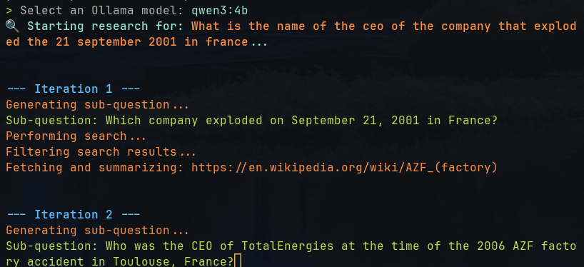

# Deep Search CLI




[](https://opensource.org/licenses/MIT)
[](https://crates.io/crates/deepsearch)
[](https://www.rust-lang.org/)

**An AI-powered research assistant for your terminal.**

Deep Search is a command-line tool that uses local large language models (LLMs) to provide in-depth answers to complex questions. It breaks down your query, scours the web for relevant information, and synthesizes a comprehensive response, all within your terminal.

## Features

*   **AI-Powered Research:** Leverages local LLMs (via Ollama) to understand and research your questions.
*   **Step-by-Step Process:** Decomposes questions, searches multiple sources (Wikipedia, DuckDuckGo), filters for relevance, and summarizes findings.
*   **Local First:** Works with your own Ollama-hosted models, keeping your data private.
*   **Minimalist CLI:** A clean, focused interface for your research tasks.

## How It Works

The tool follows a structured research workflow:

1.  **Decompose:** The initial question is broken down into smaller, specific sub-questions.
2.  **Search:** Each sub-question is researched using Wikipedia or DuckDuckGo.
3.  **Filter:** The search results are filtered to identify the most relevant sources.
4.  **Summarize:** The content of each relevant page is summarized.
5.  **Evaluate:** The summaries are used to construct a final answer. If the answer is incomplete, the process can be iterated with new sub-questions.
6.  **Answer:** A final, synthesized answer is presented to the user.

## Installation

### From Crates.io

Once the package is published to crates.io, you can install it directly using `cargo`:

```bash
cargo install deepsearch
```

This will install the `deepsearch` binary in your cargo bin directory, allowing you to run it from anywhere in your terminal.

### From Source

1.  **Install Rust:** If you don't have Rust, install it from [rust-lang.org](https://www.rust-lang.org/).
2.  **Install Ollama:** You need a running Ollama instance. See the [Ollama website](https://ollama.ai/) for installation instructions.
3.  **Clone the repository:**
    ```bash
    git clone https://github.com/LightInn/deepsearch.git
    cd deepsearch
    ```
4.  **Build the project:**

    For a development build, run:
    ```bash
    cargo build
    ```
    The executable will be at `./target/debug/deepsearch`.

    For a release (production) build, run:
    ```bash
    cargo build --release
    ```
    The executable will be at `./target/release/deepsearch`.

## Usage

Once built, you can run the tool from the command line.

### From Release Build

```bash
./target/release/deepsearch "Your research question"
```

### With Cargo

For development, you can run the tool directly with `cargo`:

```bash
cargo run -- "Your research question"
```

### Parameters

You can customize the behavior of the tool with the following parameters:

*   `--max-iterations` or `-i`: Set the maximum number of research iterations.
*   `--model` or `-m`: Specify the Ollama model to use.
*   `--verbose` or `-v`: Enable verbose output for debugging purposes.

**Example:**

```bash
./target/release/deepsearch "How does photosynthesis work?" -i 5 -m "llama3"
```

This will start a research task on "How does photosynthesis work?", with a maximum of 5 iterations, using the `llama3` model.

## Contributing

Contributions are welcome! If you'd like to contribute, please feel free to submit a pull request or open an issue.

### Prompt Engineering

A core part of this tool is the quality of the prompts used to interact with the LLM. If you have ideas for improving the prompts, you are encouraged to modify the `src/prompts.rs` file and submit a pull request. Better prompts lead to better research outcomes!

## License

This project is licensed under the MIT License. See the [LICENSE](LICENSE) file for details.
